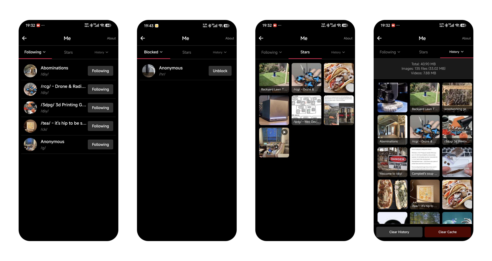

# Peek4c

> ⚠️ **IMPORTANT WARNING**  
> This is an open-source, non-profit third-party 4chan browser for educational and technical learning purposes only.
>
> 4chan.org may contain adult, violent, offensive, or illegal content. By using this app, you confirm you are 18+ and assume all risks.

> 🔔 **封闭内测（Closed Beta）**
>
> 本应用正在 Google Play 进行封闭内测。
>
> 要加入内测，请加入谷歌群组： [加入 Google 群组](https://groups.google.com/g/tikchan)。
>
> 加入后可在 Google Play 安装： [在 Google Play 安装](https://play.google.com/store/apps/details?id=io.mybatis.tikchan)。
>
> 谷歌要求：至少招募 12 名测试人员，并参与至少 14 天的封闭测试。欢迎大家积极参与！
>
> ---
>
> 🔔 **Closed Beta**
>
> This app is currently in a closed beta on Google Play.
>
> To join the beta, please join the Google Group: [Join the Google Group](https://groups.google.com/g/tikchan).
>
> After joining, install the app from Google Play: [Install on Google Play](https://play.google.com/store/apps/details?id=io.mybatis.tikchan).
>
> Google requires at least 12 testers who participate for at least 14 days. Please consider joining.

## 📱 About

Peek4c is a third-party 4chan client application built with React Native and Expo, providing a TikTok-like vertical scrolling browsing experience.

**Key Features:**
- 🎬 Vertical scrolling for browsing 4chan posts and media
- 💾 Local caching and offline browsing
- 🍀 Favorites (Peek) and browsing history
- 🔒 Local password protection
- 📱 Support for images and videos
- 🎨 Modern user interface

**Tech Stack:**
- React Native 0.81.5
- Expo SDK 54
- TypeScript
- SQLite (local database)
- expo-video (video playback)

## 📸 Product Screenshots

<!-- Screenshot 1: Board Selection -->


<!-- Screenshot 2: Main Feed View -->


<!-- Screenshot 3: Me View -->


## 📖 User Guide

1. **Password Protection**: Set a password to access the app. Use the Reset function if you forget your password (this will clear all local data)
2. **Board Selection**: Select up to 3 boards at once. Selecting more will replace the oldest selection
3. **Content Filter**: Default is worksafe. Uncheck to see NSFW boards (shown in red)
4. **Follow Tab**: Click the follow checkbox to enable the Follow navigation. Content appears after following OP threads
5. **Browsing**: Swipe up/down to browse posts. Tap the avatar with + to follow an OP (thread). Tap the avatar to view all posts from that OP
6. **Image Zoom**: Double tap images to zoom (1x → 2x → 4x → 1x), drag to pan when zoomed
7. **OP Page Actions**: 
   - Tap avatar to toggle follow
   - Long press avatar to toggle block (blocks all posts from this OP)
8. **Favorites**: Tap the four-leaf clover icon to star/favorite posts
9. **Me Section**: View Follow, Blocked, Star, and History (supports combined filtering)
10. **History Management**: Delete browsing history (causes viewed content to reappear) and clear cache
11. **Privacy**: All data is stored locally. Only 4chan API requests are made. Cached content is available offline

## ⚖️ Disclaimer

**Please read the complete [Disclaimer Document](DISCLAIMER.md)**

### Important Statements

1. **Content Source**: This app retrieves content through 4chan.org's public API. Developers do not create, host, or control any content
2. **User Responsibility**: Users must be 18+ years old, assume all risks, and comply with local laws
3. **No Warranty**: This software is provided "as is" without any warranties or technical support
4. **Privacy**: All data is stored locally on your device and not uploaded to any server
5. **Non-Profit**: This project is completely open-source and non-profit, for learning and research only

### Legal Documents

- [Full Disclaimer](DISCLAIMER.md)
- [Open Source License](LICENSE) - Apache License 2.0
- [Privacy Policy](assets/legal/privacy-policy.md)
- [Terms of Service](assets/legal/terms-of-service.md)


## 🔧 Development

For detailed build instructions, environment setup, and troubleshooting, see **[BUILD_GUIDE.md](BUILD_GUIDE.md)**.

Quick start:

```powershell
npm install
npx expo prebuild --clean
npx expo run:android
```

---


## 🤝 Contributing

Contributions are welcome! If you'd like to contribute:

1. Fork this repository
2. Create your feature branch (`git checkout -b feature/AmazingFeature`)
3. Commit your changes (`git commit -m 'Add some AmazingFeature'`)
4. Push to the branch (`git push origin feature/AmazingFeature`)
5. Open a Pull Request

**Code of Conduct:**
- Respect all contributors
- Provide constructive feedback
- Focus on technical improvements
- Follow the open-source license

## 📄 License

This project is licensed under the GPLv3 License - see the [LICENSE](LICENSE) file for details.

**Important**: The GPLv3 License means this software is provided "as is" without any warranties. You use this software at your own risk.

## ⚠️ Legal Notice

- This application has no affiliation with 4chan.org or its operators
- Developers are not responsible for content accessed through this application
- Users must comply with all applicable laws in their region
- Some regions may prohibit access to 4chan.org or its content
- By using this application, you acknowledge that you have read and agree to the [Full Disclaimer](DISCLAIMER.md)

## 📞 Contact

This project is hosted on GitHub. For questions, suggestions, or bug reports, please submit via GitHub Issues.

---

Copyright © 2025 Peek4c Contributors

GitHub Repository: https://github.com/peek4c/peek4c.git

This project is for educational and learning purposes only. Please use responsibly.
